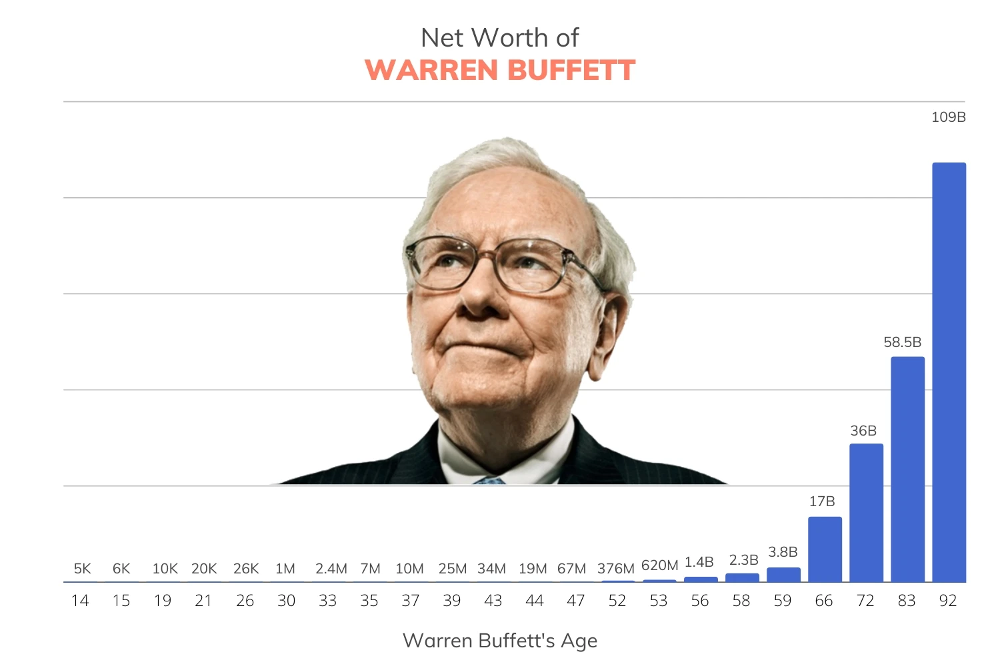

```{r data, include=FALSE}
knitr::opts_chunk$set(echo = TRUE)
library(knitr)
library(kableExtra)
library(tidyverse)
library(plotly)
library(numberFormattR)
# install.packages("plotly")

# library(gapminder)

# library(readr)
base <- read_csv("networth.csv", col_types = cols(Idade = col_integer(), 
    Capital_paste = col_character())) %>%
  mutate(Capital = as.numeric(Capital_paste),
         Variação = round((Capital / lag(Capital) - 1), 2),
         Multiplo = round((Capital / lag(Capital)), 2),
         Intervalo = Idade - lag(Idade)) 

# networth[is.na(networth)] <- ""

# networth
  

networth <- base


```


 


***

# 1 - Considerações iniciais

A fim de melhor entender a evolução do patrimônio alocado em ações do Warren Buffett, faremos aqui algumas análises para seguir os seus passos.
Mais que isso. Com o objetivo de deixar registrado o percurso para que meus herdeiros conhecam por onde passei, escrevo esse breve e descontraído documento.

Todos os gráficos e tabelas foram costurados com carinho no Rstudio, em Rmarkdown.

***

A publicação disponível em https://finmasters.com/warren-buffett-net-worth/ contém idade e capital. A elas foram adicionadas algumas colunas e tem-se a tabela 1.

  -- **variação percentual:** (período atual / periodo anterior) - 1. De 19 para 21 anos seu patrimônio dobrou, ou seja, aumentou 100%.
  
  -- **múltiplo:** (período atual / período anterior). De 19 para 21 anos seu patrimônio dobrou, ou seja, múltiplo 2.
  
  -- **período:** tempo entre os intevalos


```{r cars}

networth$Capital <- scales::dollar(networth$Capital)
networth$Variação <- scales::percent(networth$Variação)

tabela1 <- networth %>%
  select(-Capital_paste, Multiplo) %>%
  mutate(Variação = ifelse(is.na(Variação), "", Variação),
         Intervalo = ifelse(is.na(Intervalo), "", Intervalo),
         Multiplo = ifelse(is.na(Multiplo), "", Multiplo))

# tabela1 %>%  
# kbl(align = "r") %>%
#   kable_paper("hover", full_width = F)


tabela1$Variação = cell_spec(tabela1$Variação, background = ifelse(tabela1$Variação > 0 , "", "red"))
tabela1$Variação[1] <- str_replace(tabela1$Variação[1], "red", "blank")

kbl(tabela1, escape = F, align = "r") %>%
  kable_paper("striped", full_width = F)


```


É importante notar que a evolução do patrimônio de Warren Buffett é apresentada em periodos não constantes.

Um exemplo de leitura do dado é que o referido investidor apresentou ganho de 36% ao longo de 4 anos (39 a 43). Em outro momento, obteve aumento de seu capital em 65% em apenas um ano (52 para 53), conforme a coluna Invervalo registra.

Ao longo de toda a série de dados exibida na tabela acima, está clara a eficiência da estratégia de investir em Valor. Somente em um registro houve perda de capital.


# 2 - Variação do percentual do capital e múltiplo

Deixaremos de lado o montante que Warren Buffet possui e focaremos na variação percentual do capital e múltiplo entre os intervalos apresentados na tabela por dois motivos óbvios:

  1. Desproporção entre os valores iniciais e finais, que chegam a casa dos bilhões. O gráfico apresentado no início do documento (com o rosto do bilionário) faz fortunas de 34 milhões, 67 milhões e até mesmo 376 milhões parecerem pouco, em contraste com 109 bilhões. A propósito, a escala daquele gráfico deveria ter sido alterada.
  
  2. Ao olhar para a variação do capital em percentual e não em milhões e bilhões, é possível transpor o desempenho para carteiras menos volumosas, ou seja, todos nós.
  
  
A figura a seguir apresenta o múltiplo do patrimônio ao longo dos anos.

```{r}
plot1 <- base %>%
  ggplot(aes(Idade, Multiplo)) +
  geom_point(color = "blue", size = 2)
 
ggplotly(plot1)


```

Nota-se, facilmente, um ponto fora da curva (*outlier*) em que houve um aumente de 38X o capital dos 26 aos 30 anos, quando ele alcançou seu primeiro milhão.

Considerando que esse foi um aumento de capital repentino e improvável, vamos analisar sua trajetória a partir do primeiro 1 milhão.

# 3 - Um milho grande

Warren buffet levou 62 anos para transformar 1 milhão em 109 bilhões de dolares (dos 30 aos 92 anos). Nos intervalos apresentados, temos o gráfico ajustado para os multiplos após conseguir seu primeiro milhão. 

```{r}

media <- base %>%
  filter(Capital > 1000000) %>%
  summarise(media = mean(Multiplo)) %>%
  pull()

plot2 <- base %>%
  filter(Capital > 1000000) %>%
  ggplot(aes(Idade, Multiplo)) +
  geom_point(color = "blue", size = 2) +
  geom_hline(yintercept = media)


ggplotly(plot2)
```
Uma linha preta foi traçada e representa o múltiplo médio (`r round(media,2)`X ).

Novamente, é importante notar que trata-se de um múltiplo obtido para períodos variados, não constante. Diante disso, vamos calcular **qual deveria ser o múltiplo anual**, ano após ano, para que nos tornemos bibionários com o cidadão acima citado.

# 4 - O número mágico


Ir de 1 milhão para 109 bilhões representa um aumento de 109.000 vezes (109mil vezes) em um período de 62 ano. Fazendo uma conta por meio de média simples (uma abordagem simplista) tem-se um multiplicador igual a `r round(109000 ^ (1/62), 2)`, ou seja, seria necessaário apurar um ganho de **21%** ao ano, ao longo de 62 anos.

A figura abaixo apresenta o patrimônio de Warren Buffet nas barras azuis e a progressão com multiplador **1,21X** ao longo do tempo.

```{r validacao, message=FALSE, warning=FALSE}

taxa_base = 109000 ^ (1/62)

# Create a vector to store the values
values <- numeric(30)

# Set the first value
values[1] <- 1000000

# Use a loop to calculate the subsequent values
for (i in 2:30) {
  values[i] <- values[i - 1] * taxa_base
}

# Create a data frame with the values
# df <- data.frame(tempo = seq(1:30), value = values)


anual <- tibble(Idade = seq(30,92)) %>%
  mutate(tempo = Idade - 30,
         valores = 0) 

# Set the first value
anual$valores[1] <- 1000000

# Use a loop to calculate the subsequent values
for (i in 2:nrow(anual)) {
  anual$valores[i] <- anual$valores[i - 1] * taxa_base
}

plot3 <- anual %>%
  left_join(base, by = "Idade") 


plot4 <- ggplot(plot3)  +  
  geom_bar(aes(x=Idade, y=Capital),stat="identity", fill="cyan",colour="#006000")+ 
  geom_point(aes(x=Idade, y=valores),stat="identity",color="red",size=1) + 
  labs(title= "Validação da taxa anual", 
       x="Tempo (ano)",y="Capital na Bolsa (U$)") +
  scale_y_continuous(labels = suffix_formatter_0) 
 
ggplotly(plot4)


```


Embora pareça pouco, são 62 anos de ganhos consistentes. Não é coisa fácil. Em 2023 o índice IBOV ficou no valor esperado, como pode ser visto na figura criada pelo bitcoinheiro Renato 38tão.

<center>
{width=50%}
<\center>

# 5 - Cenários

Um fator de extrema importância no sucesso do investidor em análise é o tempo de dedicação ao mercado financeiro. Foram 62 anos depois do seu primeiro milhão e ainda mentêm o fôlego. Contudo, 62 anos é muito tempo para o investidor comum. 

## 5.2 - Efeito dos multiplos em 30 anos

Partindo-se de 1 milhão de dolares, foi calculado o montante ao final de 30 anos para três diferentes multiplicadores: 1.10X, 1.15X e 1.21X (Warren Buffet). os graficos são apresentados em um gráfico com os respectivos valores exibidos em uma tabela. 

Resultados dessa magnitude contemplam o reinvestimento de eventuais dividentos, porém a simulação não considera aportes adicionais.

```{r taxas_30anos, message=FALSE, warning=FALSE}

anos <- 10
taxas <- c(round(taxa_base,2), 1.10, 1.15)
tempo <- anos + 1
inicio <- 1000000
# historico$valores[1] <- inicio

for (j in 1:length(taxas)) {

# Create a vector to store the values
values <- numeric(tempo)

# Set the first value
values[1] <- inicio  
  
# Use a loop to calculate the subsequent values
for (i in 2:tempo) {
  values[i] <- values[i - 1] * taxas[j]
}


temp <- tibble(tempo = seq(0, anos)) %>%
  mutate(valores = values,
         taxa = taxas[j])

ifelse(j == 1,
   historico <- temp,
   historico <- rbind(historico, temp))

}

plot5 <- historico %>%
  # filter(taxa < 1.25) %>%
  ggplot(aes(tempo, valores, group = taxa, color = as.factor(taxa))) +
  geom_line(size = 1.5) +
  scale_y_continuous(labels = suffix_formatter_0) 
  # scale_y_log10()

  # geom_bar(aes(x=, y=Capital),stat="identity", fill="cyan",colour="#006000")+ 
  # geom_point(aes(x=Idade, y=valores),stat="identity",color="red",size=1) + 
  # labs(title= "Validação da taxa anual", 
  #      x="Tempo (ano)",y="Capital na Bolsa (U$)") +
  # scale_y_continuous(labels = suffix_formatter_0) 
 
ggplotly(plot5)


historico %>%
  arrange(taxa, tempo) %>%
  mutate(valores = map(valores, number_formatter, currency = TRUE, digits = 3) %>% unlist()) %>%
  pivot_wider(names_from = taxa,
              # names_prefix = "Multiplicador ",
              values_from = valores) %>%
  kbl(escape = F, align = "r") %>%
  kable_paper("hover", full_width = F) %>%
  add_header_above(c(" ", "Multiplicador" = length(taxas))) %>%
  scroll_box(width = "100%", height = "300px")
  


```

Após 10 anos, o patrimônio teria aumentado 2,59X, 4X e 6,7X para as respectivas taxas utilizadas. Tomando-se o multiplicador 1.15, este apresenta uma dobra de capital a cada 5 anos, um valor muito significativo pois é importante lembrar que estes cálculos consideram somente a multiplicação do capital inicial, sem a realização de novos aportes. 


## 5.2 - Dobra de capital a cada 18 meses

Chegou a meu conhecimento o trabalho da INVEST MULT CAPITAL ALLOCATION, que segue o conceito de *value investing* e busca oportunidade de dobra de capital em papeis com a relação P/VP muito descontada.

A dobra de capital a cada 18 meses (um ano e meio) é o mesmo que um multiplicador de **1,587X ao ano**, ou ainda, aumentar o capital em **58.7% ao ano**. Qual seria o resultado ao final de 9 anos comparado lado a lada com o desempenho médio de Warren Buffet? 

```{r leo_X_warren, message=FALSE, warning=FALSE}

anos <- 9
taxas <- c(round(taxa_base,2), 1.587)
tempo <- anos + 1
inicio <- 1000000
# historico$valores[1] <- inicio

for (j in 1:length(taxas)) {

# Create a vector to store the values
values <- numeric(tempo)

# Set the first value
values[1] <- inicio  
  
# Use a loop to calculate the subsequent values
for (i in 2:tempo) {
  values[i] <- values[i - 1] * taxas[j]
}


temp <- tibble(tempo = seq(0, anos)) %>%
  mutate(valores = values,
         taxa = taxas[j])

ifelse(j == 1,
   historico <- temp,
   historico <- rbind(historico, temp))

}

plot5 <- historico %>%
  # filter(taxa < 1.25) %>%
  ggplot(aes(tempo, valores, group = taxa, color = as.factor(taxa))) +
  geom_line(size = 1.5) +
  scale_y_continuous(labels = suffix_formatter_0) 
  # scale_y_log10()

  # geom_bar(aes(x=, y=Capital),stat="identity", fill="cyan",colour="#006000")+ 
  # geom_point(aes(x=Idade, y=valores),stat="identity",color="red",size=1) + 
  # labs(title= "Validação da taxa anual", 
  #      x="Tempo (ano)",y="Capital na Bolsa (U$)") +
  # scale_y_continuous(labels = suffix_formatter_0) 
 
ggplotly(plot5)


historico %>%
  arrange(taxa, tempo) %>%
  mutate(valores = map(valores, number_formatter, currency = TRUE, digits = 3) %>% unlist()) %>%
  pivot_wider(names_from = taxa,
              # names_prefix = "Multiplicador ",
              values_from = valores) %>%
  kbl(escape = F, align = "r") %>%
  kable_paper("hover", full_width = F) %>%
  add_header_above(c(" ", "Multiplicador" = length(taxas))) %>%
  scroll_box(width = "100%", height = "300px")
  


```

# 6 - Consideraçõe Finais

Seria possível transformar 1milhão em 64milhões em 9 anos, conforme as simulações acima?
Teriamos oportunidades de alocação para este volume de compra, teriamos liquidez?

São respostas que obteremos ao longo da nossa caminhada e é lá que desejo estar daqui a 9 anos.


# 7 - Material adicional

 
[Lista completa de ativos de Warren Buffet](https://finmasters.com/berkshire-hathaway-portfolio-tracker/)


```{r chart2, include=FALSE}


# 
# 
# plot3 <- anual %>%
#   mutate(Valores = map(valores, number_formatter, currency = TRUE, digits = 2) %>% unlist()) %>%
#   left_join(base, by = "Idade") %>%
#   mutate(Capital2 = ifelse(is.na(Capital), 0, Capital)) %>%
#   mutate(Capital_2 = map(Capital2, number_formatter, currency = TRUE, digits = 2) %>% unlist()) 
# 
# # map(plot3$Capital_2, number_formatter, currency = TRUE, digits = 2) %>% unlist()
# 
# plot3 %>%
#   ggplot(aes(Idade, Capital2)) +
#   geom_point()
# 
# # library(numberFormattR)
# plot3 %>%
#   # mutate(Capital2 = ifelse(is.na(Capital_2), "", Capital_2)) %>%
# ggplot(aes(Idade, Capital2)) + 
#         geom_bar(stat = "identity") + 
#         scale_y_continuous(labels = suffix_formatter_0) + 
#         scale_fill_manual(values = c("tomato", "steelblue"))
# 
# plot4 <- ggplot(plot3)  +  
#   geom_bar(aes(x=Idade, y=Capital2),stat="identity", fill="cyan",colour="#006000")+ 
#   geom_point(aes(x=Idade, y=Valores),stat="identity",color="red",size=1) + 
#   labs(title= "Validação da taxa anual", 
#        x="Tempo (ano)",y="Capital na Bolsa (U$)") 
#  
# ggplotly(plot4)
```

